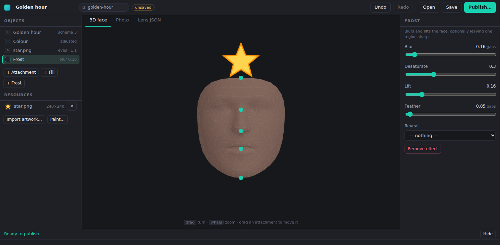

# Kyron Lens Studio

Draw a lens, place it on a face, publish it.

A Windows desktop tool for authoring lenses for
[KyronLabs/kyron-lenses](https://github.com/KyronLabs/kyron-lenses) — paint
something, position it on a 3D face, see it the way the camera will, and open
a pull request against the catalogue without touching JSON.

> **State: the editor runs, and the Windows installer is built on every
> push.** The panels, the 3D face, the colour engine and the publish plan all
> work and are photographed on every push — in headless Chromium, because
> Electron's renderer *is* Chromium and the machine this was built on is not
> Windows. `electron-builder --win` now runs on a Windows runner and the
> installer it produces is checked before it is uploaded: it has to be an
> NSIS executable of a plausible size, carrying an application named Kyron
> Lens Studio, whose packaged payload holds every file the renderer loads.
> Tagging a version publishes that same installer as a GitHub release.
> What still has not been executed anywhere is `electron .` on a real
> desktop — the window has never been opened by a person. [What is here and
> what is next](#what-is-here) keeps that line visible.

---

## The problem it solves

A lens is a small JSON object, and the app is strict about it. Three kinds:

| | What it is |
|:--|:--|
| **Colour** | Twenty numbers — a 4×5 colour matrix applied per pixel. |
| **Face** (`schema: 2`) | Pictures hung on a tracked face: an asset, an anchor, a width. |
| **Effect** (`schema: 3`) | Changes to the face itself: a region filled with sampled skin, or everything frosted but the eyes. |

Two of those are hard to author by hand, for the same reason:

**Every measurement is in pupil-gaps.** Not pixels, not a fraction of the
frame — multiples of the distance between the two pupils. That is what makes a
lens correct at any distance from the camera, on any face, at any resolution,
with nothing to tune per device. It is also completely unlike how anybody
draws: an artist works in pixels on a picture, and the file wants gaps from an
anchor, in a frame that **rotates with the head**.

So hand-authored lenses are guesswork, and a wrong one is not obviously wrong
until it is on somebody's face. This tool does that conversion, both ways, and
renders the preview from the file it is about to publish rather than from what
the editor meant.

## Why a third implementation of the rules exists

There were already two: `Lens.tryParse` in the Kyron app (Dart) and
`problems()` in `kyron-lenses/tools/lens.py`. That repository's `FORMAT.md` is
blunt about the danger — *"a lens that passes the tool, gets published, and is
then dropped by the app leaves its explanation in a log line on a stranger's
phone."*

`src/format/lens.js` is a third anyway, because the studio has to tell somebody
their lens is wrong **while they are drawing it**, and shelling out to Python
on every keystroke would mean shipping a Python runtime inside a Windows app to
answer a question that is twenty comparisons.

What makes it safe is the same thing that makes the other two safe:
**`test/format-vectors.json` is copied from kyron-lenses and run against it on
every change.** All 106 cases, or the build fails.

That guard is not decorative. Three rules were deliberately loosened to check
it bites, and each was caught by name:

| Loosened | Caught by |
|:--|:--|
| allow `http://` assets | `refuses ar-asset-plain-http` |
| let a frost `blur` of 0 through | `refuses fx-frost-blur-zero` |
| drop "attachments need schema 2" | `refuses ar-attachments-claiming-schema-1` |

Refresh the vectors with `npm run vectors:refresh`.

## What is here



Four regions, which is the shape every editor of this kind has settled on and
Lens Studio included: what is in the thing on the left, the thing itself in the
middle, the properties of whatever is selected on the right, and what is wrong
at the bottom.

| | |
|:--|:--|
| **Objects** | The lens's own contents — colour, each attachment, each effect — in the order the app applies them. |
| **Resources** | Artwork, imported or painted. Drop a PNG anywhere in the window. |
| **The face** | MediaPipe's canonical mesh, the same one the app's tracker fits to a real face. Every anchor is marked. Drag an attachment to move it; the drag comes back as pupil-gaps. |
| **Photo** | The colour matrix over a reference chart — skin through shadow, a grey ramp — which says more about a matrix than a single face does. |
| **Lens JSON** | The object that would be written into the catalogue. Every preview is drawn from this rather than from the editor's state, so what is on screen is the file. |
| **Inspector** | The selected thing, in units somebody can picture: `1.1 gaps · about 69mm`. |
| **Logger** | Everything between here and publishable, in the app's own words, live. |

```
src/format/lens.js     the rules — what the app will and will not draw
src/format/matrix.js   sliders → the twenty numbers, and back to pixels
src/format/face.js     pupil-gap geometry, both directions
src/format/project.js  what is edited → what is published
src/app/state.js       the editor: selection, undo, every change
src/app/units.js       gaps in millimetres, and every control's ends
src/app/viewport.js    the 3D face
src/app/paint.js       the canvas
src/main/              Electron: a window, and four calls that touch the disk
```

```bash
npm test        # 194 tests, no install needed
npm start       # the app, on Windows
npm run shots   # photograph the window in headless Chromium
npm run dist    # the Windows installer
npm run anchors # print the anchor table, derived from the mesh
```

### Releasing

Run **Create Versioned Release** from the Actions tab and pick patch, minor or
major. It bumps `package.json`, commits, and pushes an annotated `vX.Y.Z` tag;
the tag starts **Release**, which builds the installer on a Windows runner,
runs the same guard CI runs, and publishes it with its SHA-256.

The release workflow refuses a tag whose version does not match
`package.json` — a tag can be pushed at any commit, including one that was
never bumped, and the installer would otherwise be published under a version
it does not contain.

### The colour panel is nine sliders, not twenty numbers

Twenty fields is not an editor. `matrix.js` is the translation: exposure in
stops, contrast about mid grey, saturation onto Rec. 709 luminance, temperature,
tint, hue, sepia, invert, and a wash — each one a matrix, composed by
multiplication, checked on pixels rather than on coefficients.

Three things in there are worth knowing before changing any of it:

**Order matters, for 31 of the 45 pairs.** Exposure then contrast is not
contrast then exposure. `ORDER` fixes it so that two people describing the same
lens get the same twenty numbers, rather than the answer depending on which
slider was touched last.

**The other 14 pairs genuinely commute**, which is not obvious. Saturation
leaves neutral colours alone and contrast is a scalar plus a neutral offset, so
those two agree either way — and so do contrast and invert. The test asserting
non-commutativity was first written on contrast and saturation, and failed,
correctly.

**It only goes one way.** A matrix cannot be turned back into sliders: many
settings reach the same twenty numbers. So the project file keeps the
adjustments *alongside* the matrix, and a matrix somebody typed wins until a
slider is touched — at which point the panel says so and takes over. Offering
sliders that claim to describe a hand-written matrix would move it the moment
anybody touched one.

Every slider's ends are checked against the format in a test: a control that
can reach a value the app refuses is a control that builds an unpublishable
lens and says nothing about which one did it.

### Publishing stops one step short

`publishPlan` names the file to write and the catalogue entry to add, the main
process writes them into a checkout of kyron-lenses, and then it stops and says
so. Committing is somebody putting their name on a change that reaches every
phone running Kyron, and the last step is theirs.

### The anchors are measured, not written down

`ANCHOR_OFFSETS` says where the forehead, nose, mouth and chin sit relative to
the pupils. The first version was four numbers somebody sensible wrote down,
and **every one of them was wrong**:

| anchor | written down | measured |
|:--|--:|--:|
| forehead | −0.62 | **−0.8945** |
| nose | 0.52 | **0.5953** |
| mouth | 0.95 | **1.0937** |
| chin | 1.48 | **1.9085** |

The chin by 0.43 pupil-gaps — most of an eye-spacing, about two and a half
centimetres on a real face. A lens anchored there would have sat visibly low
in the studio *and* on the phone, agreeing with itself the whole way and
matching nothing.

They now come out of `assets/face/canonical_face_model.obj` — MediaPipe's own
mesh, the one `mediapipe_face_mesh` gives the app — at the landmark indices
`kyron-lenses/tools/face.py` names. `npm test` re-derives the table on every
run and fails if the source drifts from the mesh, so they stay checked data
rather than remembered data.

`face.js` carries the part that is hardest to retrofit and easiest to get
subtly wrong:

- **`FaceFrame`** — two pupils in pixels is everything. The gap between them
  is the unit, the midpoint is the origin, the angle is the head's roll. Two
  pupils in the same place throws rather than producing `Infinity` widths.
- **`attachmentFor`** — a drag on the canvas → the four numbers a lens is
  written in. It does **not** clamp: a width of 40 gaps means somebody dragged
  something absurd, and quietly making it 12 would publish a lens they did not
  draw. The format check says no instead.
- **`placementFor`** — the inverse, which draws the preview.

The property the whole format rests on is a test: *a lens authored on one face
lands on the same features on a face twice the size*, and *a lens authored
against a 25° head tilt comes out upright*.

## What is next

Honestly, in the order it should be done:

1. **Open the window on Windows.** `npm run dist` now runs in CI on every
   push and its output is checked, so the installer is real. `npm start` — the
   app running in front of a person, on a desktop — still has not happened,
   and nothing in this README should be read as saying otherwise.
2. **A real photograph behind the effects.** A fill takes skin sampled from a
   face and paints a region of that same face with it; a chart cannot show
   that. This needs a photograph somebody consented to being shipped in a
   tool, which is a decision rather than a task.
3. **Drag to resize and rotate**, not just to move. The handles are the
   obvious next thing on the face, and `attachmentFor` already does the
   arithmetic.
4. **Open the pull request**, rather than writing into a checkout and stopping.
   Wants a token, which wants a settings screen, which wants somewhere to keep
   a secret on Windows.
5. **Templates.** Lens Studio opens on a gallery of them, and it is the right
   idea: most lenses are a variation on a handful of shapes.

### The stack, and why

**Electron + Three.js.** Three.js is the only part of this that is not a
choice: a face mesh you can turn, with artwork positioned against it, is what
it is for. Canvas 2D handles the painting, Node handles the files, and
`electron-builder` produces the Windows installer, pinned to an exact
version along with Electron itself: it refuses to build from a range, so
`npm run dist` could not have worked until both were pinned.

The camera over that mesh is **orthographic**, and that is not a style
decision. An attachment is a flat sprite in the pupil-gap plane: offset Y of
−1.35 means "1.35 gaps above the pupil line" and nothing else. Under
perspective, a sprite drawn in front of the face is magnified and pushed away
from the centre of the frame, so a sticker set to sit on the forehead appears
above it — by an amount depending on how far forward it happens to be drawn.
Every number in the inspector would be quietly contradicted by the picture
next to it. With no perspective there is no parallax, and turning the head
still shows a sprite for the flat thing it is.

Flutter was the obvious alternative — it is what the Kyron app is written in
and what the team already knows — and was rejected on one point: Flutter has
no mature 3D. Everything in that space is early, and the face mockup is the
centre of this tool rather than an ornament on it.

## Windows only

On purpose. This is an authoring tool for people making lenses, not something
readers install, and one platform means one set of build problems. Nothing in
`src/format/` is platform-specific — it is plain JavaScript with no
dependencies, and the tests run anywhere.

## Licence

MIT, like the catalogue it publishes to.
